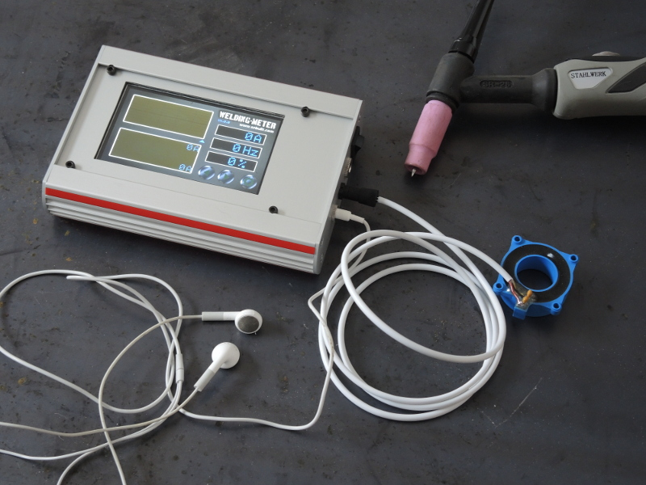

# WeldingMeter

###A welding meter/scope with voice output. 
This is perfect for TIG welding with a foot pedal.
The actual current is read with voice output. For welding with pulse function the pulse frequency,
duty cycle, minimum and maximum values and also the current curve is displayed.
After the current reaches a value below 5A, the scope is automatically stopped and there is a history memory, 
so it's possible to go scroll back the last 60 seconds.

Voice output in german and danish language.
Measurement range -300A to +300A.

### Intro screen

### Main screen

### Settings screen

## Part list
1x STM32F746G-DISCO discovery board  
1x Current sensor 200A LEM HTFS 200-P (eg. Farnell 9135715)  
3x Resistor 1k 1%  
1x Capacitor 4.7nF  
3x Capacitor 47nF  
6-7V voltage source (eg. 5x NiMH)  

## How to connect the sensor

