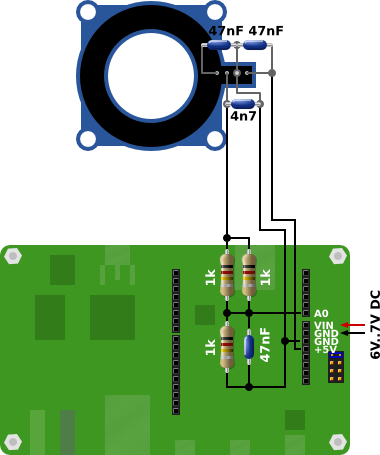

# WeldingMeter

A welding meter with voice output

### Intro screen

### Main screen

### Settings screen

## Part list
1x STM32F746G-DISCO discovery board  
1x Current sensor 200A LEM HTFS 200-P (eg. Farnell 9135715)  
3x Resistor 1k 1%  
1x Capacitor 4.7nF  
3x Capacitor 47nF  
6-7V voltage source (eg. 5x NiMH)  

## How to connect the sensor

